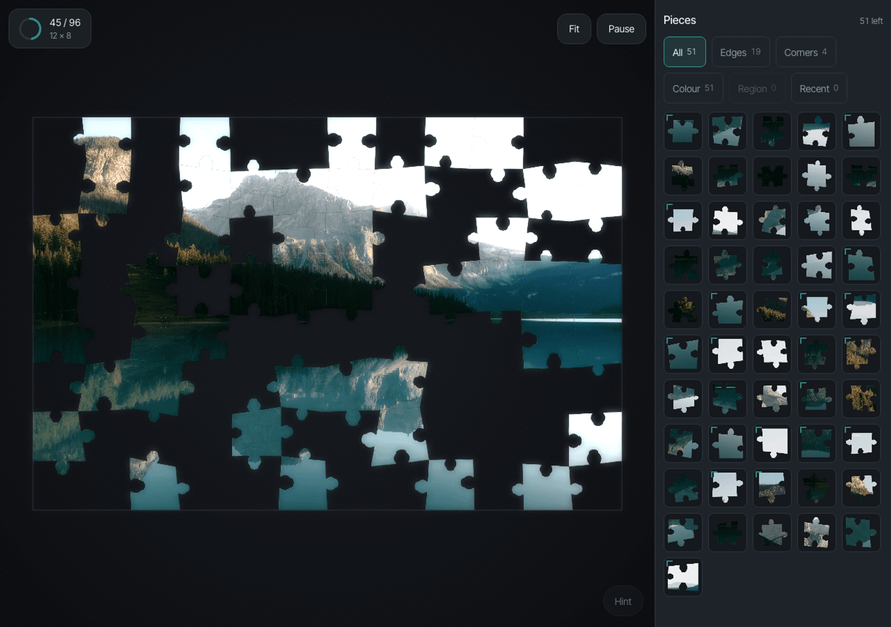

# Tessera

**A jigsaw puzzle a grandparent with a motor tremor can actually finish on an iPad.**

That's the mission, not a feature. Most touch-based puzzle games assume steady hands and precise
taps — a small drag target, a bounce-back on a near-miss, colour as the only way to tell pieces
apart. Tessera is built the other way: generous snap tolerance, no punishment for a dropped piece
landing slightly off, and every piece of state distinguishable by more than colour alone. It's also
just a satisfying way to spend forty minutes — give it any photo and it becomes a real jigsaw with
real weight, pieces you pick up, drag, and snap into place.

The board starts as a dark, unlit mat holding scattered fragments. As you assemble it, the completed
area emits light onto the mat around it — progress *is* illumination, literally:



Web-first, and built for iPad and iPhone touch from day one — not adapted to touch afterward.

## Running it

```bash
npm install
npm run dev
```

The dev server is host-exposed, so the printed network URL works from an iPad or iPhone on the same
network — real-hardware testing is a gate at every step of this project, not an afterthought. One
page, `/`, is the whole product.

## Status

Built and gated (unit tests, typecheck, build, and the full browser suite all green): the cut and
renderer, drag/snap/spring/audio, the tray and its six lenses, the pinned shelf and multi-select
pull-out, the light system (progress bloom, hint glow, merge seam, completion payoff), accent
extraction, the photo picker (30 real curated photographs plus your own upload — **including HEIC**,
what an iPhone shoots by default), puzzle setup with the four accessibility assists, the library and
save/resume, the daily puzzle and its streak, and the completion payoff (the Puzzle Card and the
collection wall).

Open: a guided first-run tutorial, and the PWA/offline pass. See
[`CONTRIBUTING.md`](CONTRIBUTING.md) if either of those is what brought you here — both have
`good first issue`s and larger `help wanted` chunks on the tracker.

## Contributing

Accessibility fixes, in particular, are exactly the contributions this project wants — see
[`CONTRIBUTING.md`](CONTRIBUTING.md) for setup, the two-suite testing posture, and the acceptance
criteria that make accessibility a first-class review gate rather than optional polish. This project
is under the [Contributor Covenant](CODE_OF_CONDUCT.md).

```bash
npm test             # vitest — pure functions, node environment
npm run test:browser # Playwright — the app, in a real browser, dock and phone viewports
npm run typecheck
npm run build
```

`npm run test:browser` boots the dev server itself and drives the real app. It is a gate at the end
of every change, not an optional extra: a green unit suite says nothing about whether the app boots,
and two of the invariants that matter most — **the board never re-renders through React**, and
**an idle board draws nothing at all** — are only observable in a browser. Both are measured rather
than asserted.

## Architecture

[`ARCHITECTURE.md`](ARCHITECTURE.md) is the contributor-facing map of the three subsystems (the
engine, the chrome, persistence) and where to start reading for a given kind of change.
[`CLAUDE.md`](CLAUDE.md) is the deeper reference underneath it — the invariants, the three
coordinate spaces, and the hard numbers everything is measured against.

Canvas 2D on a five-layer stack with a DOM chrome shell — not WebGL, not DOM pieces. At the locked
250-piece ceiling there is nothing WebGL buys over a per-frame `drawImage` loop across pre-rendered
bitmaps, and it costs shader authoring, iOS context-loss handling, and making text your problem. The
renderer sits behind a thin `draw(scene, camera)` interface so a WebGL backend can slot in later if
a much higher piece ceiling ever needs it.

React 19 + Tailwind v4 + Zustand carry the chrome. **The board never re-renders through React**:
piece positions update at 60fps outside it, and React reads only summary state that changes at
human speed. Everything with a real decision in it — the lens filter, the colour binning, the
pointer machines, the cut itself — is DOM-free and unit-tested; the files that touch the DOM, React,
or Web Audio stay thin enough to judge by hand, which is the only way snap *feel* can be judged
anyway.

The cut is deterministic from a seed and stores neither geometry nor piece images — a saved puzzle
is a few kilobytes regardless of piece count.

## Licence

Code is MIT — see [`LICENSE`](LICENSE). The curated photographs under `assets/curated/` are
licensed separately (Unsplash License, not CC0) — see [`ASSETS-LICENSE.md`](ASSETS-LICENSE.md)
before assuming the code licence covers them.
